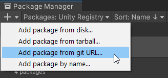
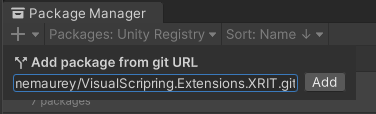
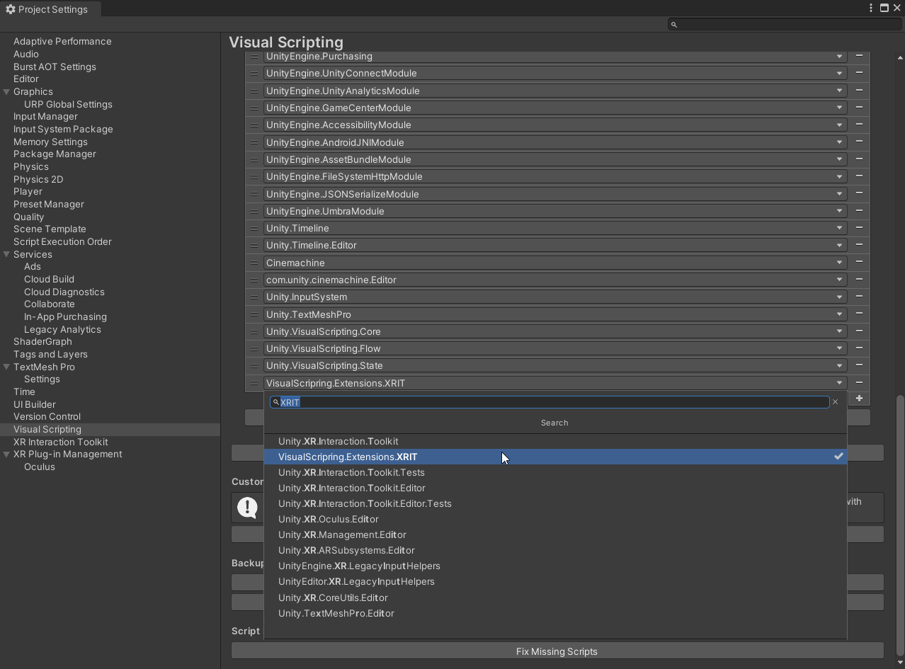
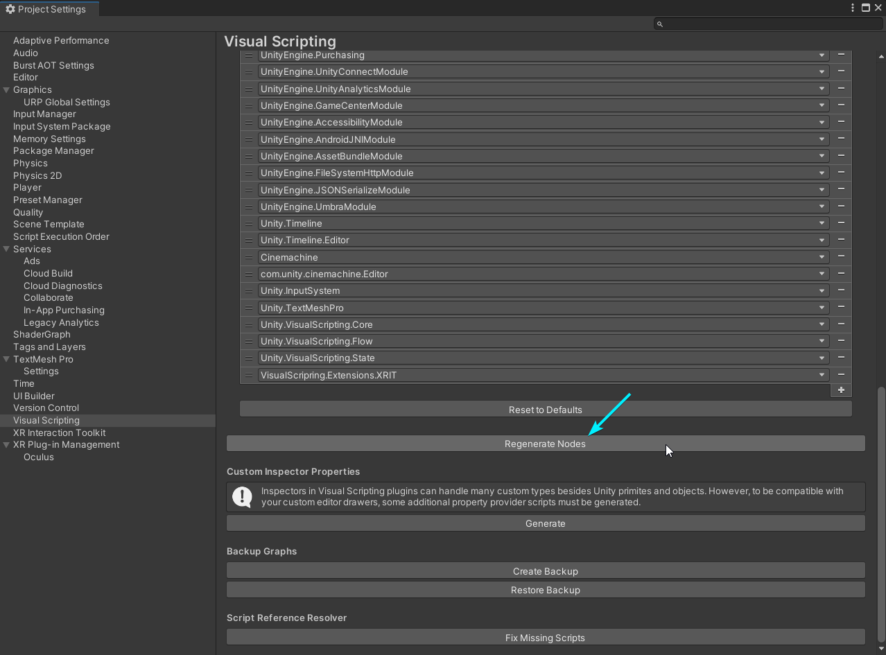
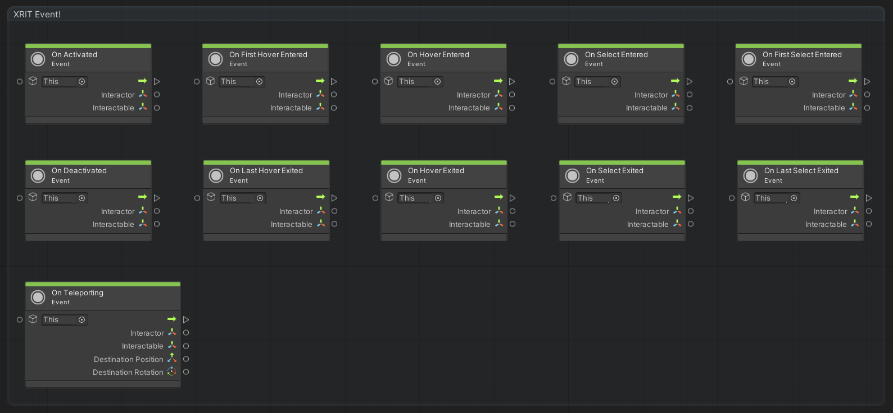
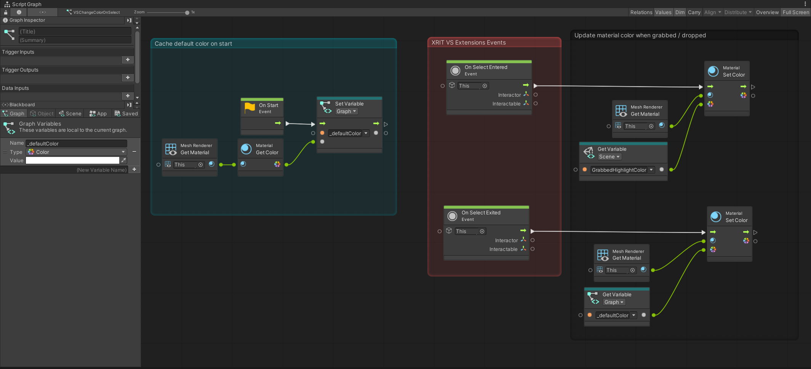

Visual Scripting extensions for XR Interaction Toolkit
====

## Warning!
> This **experimental** package is developed by **me**, not Unity. Unity does not support experimental packages and does not guarantee that experimental packages will be fully released and verified to be safe to use in production.

## About this project
As part of the [Road to Metaverse, Creator Series](https://create.unity.com/road-to-metaverse), I am developing a set of extensions to Unity's Visual Scripting that integrate XR Interaction Toolkit features. This project also serves as a learning and documenting exercise to ensure better on-boarding as we start creating XR experiences.

  Check out [this fork](https://github.com/jeromemaurey/XRIT-VS-Extensions-Examples) of the XR Interaction Toolkit Examples that integrates these extensions and contains examples for Visual Scripts re-creating the C# versions in the Demo scene. See release notes below for supported features.

 

# Getting started

Visual Scripting extensions for XR Interaction Toolkit is a Unity [package](https://docs.unity3d.com/Manual/Packages.html). To import it into your Unity project follow the below steps:

1. Open your Unity project and select `Window > Package Manager` from the file menu bar

    > This package requires Unity 2021.3 and above.

    

2. Click the `'+'` icon within the Package Manager and select `"Add package from git URL..."`

3. Paste *https://github.com/jeromemaurey/VisualScripring.Extensions.XRIT.git* into the text field and click `"Add"`

    

4. Visual Scripting extensions for XR Interaction Toolkit is now be installed within your Unity project as an read-only package within the project's `Packages` folder named `Visual Scripting extensions for XR Interaction Toolkit`.

5. Open the Project Settings `Edit > Project Settings...` and select the `Visual Scripting` tab. 

6. Expand the `Node Library` list.

    

7. Scroll to the bottom of the list, click `+` and add the `VisualScripting.Extensions.XRIT` namespace.

    

8. Click `Regenerate Nodes`.

    

### **And you're done!** 

    

 

# Usage

## Reference event nodes (v0.0.1)
 

 ## Changing a material color on select (part of [this project](https://github.com/jeromemaurey/XRIT-VS-Extensions-Examples))

  

# Release note
## Version 0.0.1
- Initial release
- Created custom event nodes for Interactables & Teleporting
  - OnActivated
  - OnDeactivated
  - OnFirstHoverEntered
  - OnFirstSelectEntered
  - OnHoverEntered
  - OnHoverExited
  - OnLastHoverExited
  - OnLastSelectExited
  - OnSelectEntered
  - OnSelectExited
  - OnTeleporting
- Loads of refactoring and noodling : )
